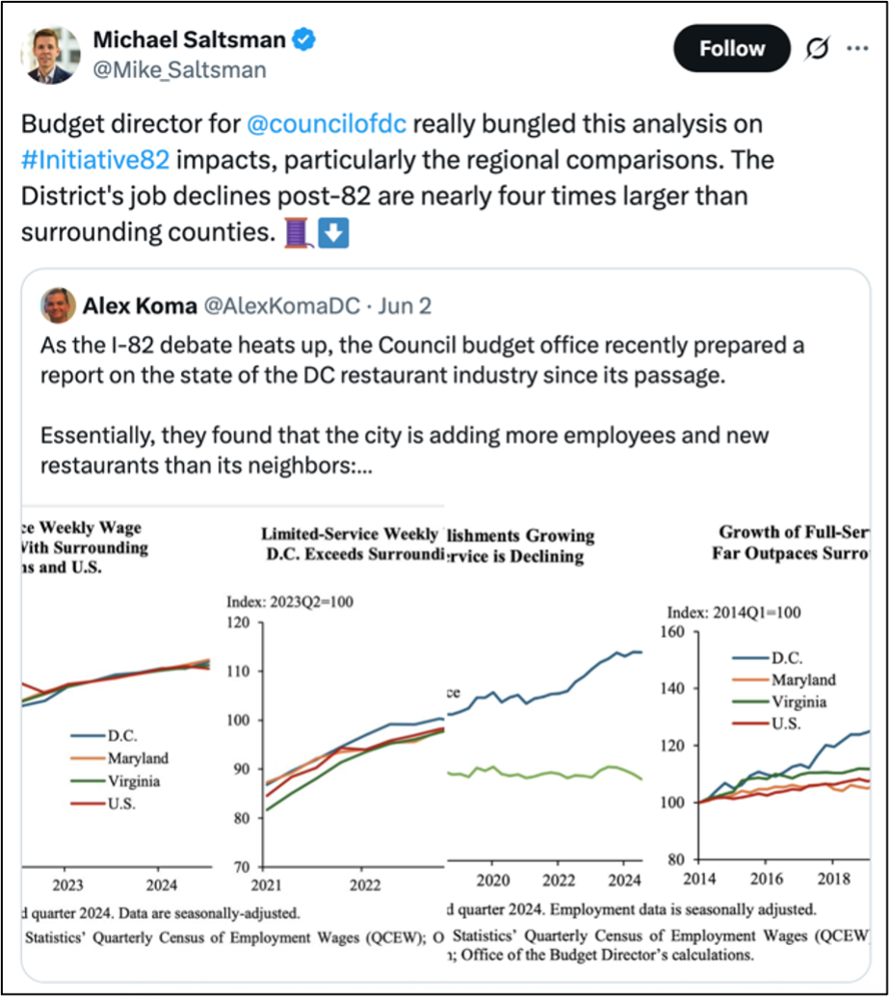
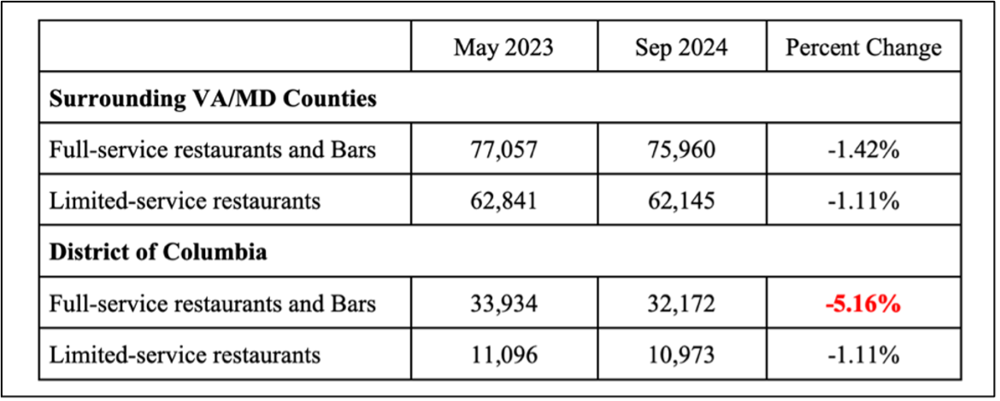
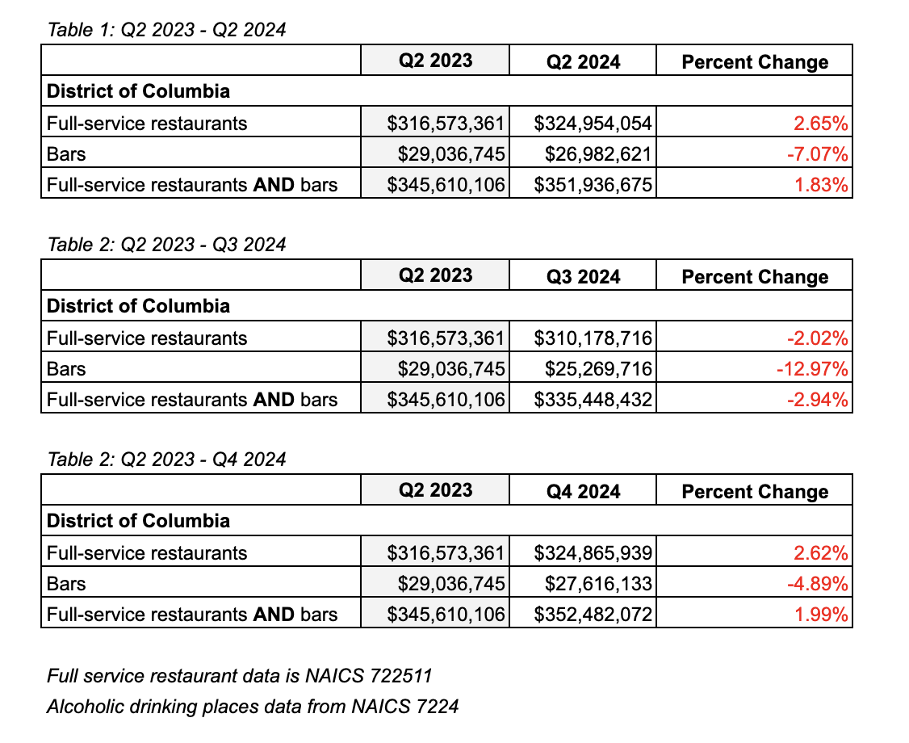
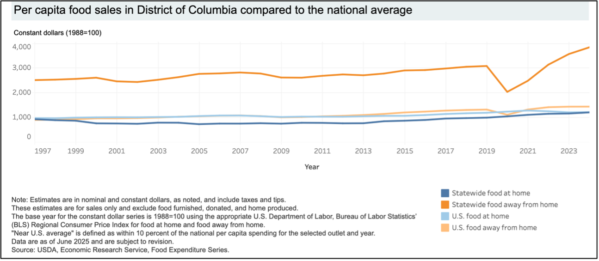
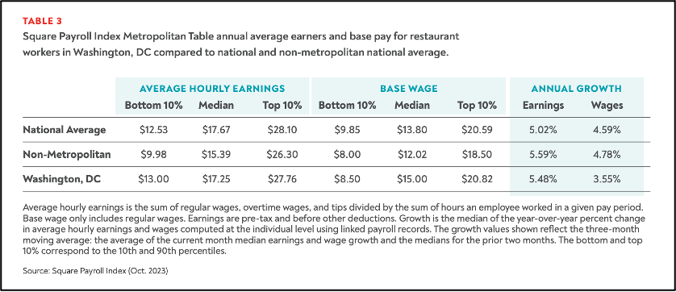

```{r setup, include=FALSE}
knitr::opts_chunk$set(echo = FALSE)
```

```{r load-libraries, message=FALSE, warning=FALSE}

# Load required libraries

library(utils) # for download.file and unzip
library(readr)
library(tidyverse)
library(stringr)
library(lubridate)
library(cowplot)
library(ggrepel)

```

```{r dowload-data, message=FALSE, warning=FALSE}

# Download data

## Create lists of csv files 
csv_list_all <- list.files("./All_csvs")

csv_list_fs <- csv_list_all[grepl("722511", csv_list_all)] # Full service restaurants
csv_list_ls <- csv_list_all[grepl("722513", csv_list_all)] # Limited service restaurants
csv_list_b <- csv_list_all[grepl("7224", csv_list_all)] # Drinking places 

## Create empty data.frame

cols <- names(read_csv(file = paste0("./All_csvs/", csv_list_all[1]))) # Get list of column names 
df = data.frame(matrix(nrow = 0, ncol = length(cols))) # Initialize empty df
colnames(df) = cols


## Create vector of variables of interest

vars_list <- c("area_fips", "area_title", "own_code", "industry_code", "agglvl_code", "year", "qtr", "qtrly_estabs_count", "month1_emplvl", "month2_emplvl", "month3_emplvl", "avg_wkly_wage")

fips_list <- c("11001", "24000", "51000")

```


```{r load-csvs, message=FALSE, warning=FALSE}

# Loop through csv lists to load all csvs by NAICS code
      ## vars_list, fips_list defined above

df_list_fs <- lapply(csv_list_fs, function(x) 
  filter(select(read_csv(file = paste0("./All_csvs/", x)), vars_list), area_fips %in% fips_list))

df_list_ls <- lapply(csv_list_ls, function(x) 
  filter(select(read_csv(file = paste0("./All_csvs/", x)), vars_list), area_fips %in% fips_list))

df_list_b <- lapply(csv_list_b, function(x) 
  filter(select(read_csv(file = paste0("./All_csvs/", x)), vars_list), area_fips %in% fips_list))
```


```{r rbind-tables, message=FALSE}

# Rbind tables  

df_fs <- do.call(rbind, df_list_fs) ## Full service restaurants

df_ls <- do.call(rbind, df_list_ls) ## Limited service restaurants

df_b <- do.call(rbind, df_list_b) ## Bars and drinking places


```

```{r create-dates, message=FALSE, warning=FALSE}

# Convert quarter & year variables to dates 
  ## Creating "date" with the structure "%Y-%m-%d" for the start of each qtr

df_fs <- df_fs %>% mutate(month = case_when(qtr==1 ~ "01",
                                   qtr==2 ~ "04",
                                   qtr==3 ~ "07",
                                   qtr==4 ~ "10"),
                   date = as.Date(paste(year, month, "01", sep = "-")))


df_ls <- df_ls %>% mutate(month = case_when(qtr==1 ~ "01",
                                   qtr==2 ~ "04",
                                   qtr==3 ~ "07",
                                   qtr==4 ~ "10"),
                   date = as.Date(paste(year, month, "01", sep = "-")))


df_b <- df_b %>% mutate(month = case_when(qtr==1 ~ "01",
                                   qtr==2 ~ "04",
                                   qtr==3 ~ "07",
                                   qtr==4 ~ "10"),
                   date = as.Date(paste(year, month, "01", sep = "-")))

```


```{r restructure-data, message=FALSE, warning=FALSE}

# Restructure datasets
  ## Data for each NAICS code is further categorize by "own_code"
  ## Own code 1 == Federal government 
  ## Own code 5 == Private
  ## The data should be restructured to show the sum across all ownership types

df_fs_sums <- df_fs %>% group_by(area_fips, area_title, industry_code, year, qtr, date) %>% 
  summarise(all_qtrly_estabs_count = sum(qtrly_estabs_count),
            all_month1_emplvl = sum(month1_emplvl),
            all_month2_emplvl = sum(month2_emplvl),
            all_month3_emplvl = sum(month3_emplvl)) %>% ungroup()

df_ls_sums <- df_ls %>% group_by(area_fips, area_title, industry_code, year, qtr, date) %>% 
  summarise(all_qtrly_estabs_count = sum(qtrly_estabs_count),
            all_month1_emplvl = sum(month1_emplvl),
            all_month2_emplvl = sum(month2_emplvl),
            all_month3_emplvl = sum(month3_emplvl)) %>% ungroup()


df_b_sums <- df_b %>% group_by(area_fips, area_title, industry_code, year, qtr, date) %>% 
  summarise(all_qtrly_estabs_count = sum(qtrly_estabs_count),
            all_month1_emplvl = sum(month1_emplvl),
            all_month2_emplvl = sum(month2_emplvl),
            all_month3_emplvl = sum(month3_emplvl)) %>% ungroup()

```


```{r p1-data}

# Plot 1: Growth of full-service establishments in DC (Index==2014)

## Subset data for plot 1, with index year = 2014
index_year <- 2014

p1_subset <- df_fs_sums %>% mutate(type = "Full-Service") 

## Calculate indexed growth rates for 2014
dc_index <- p1_subset %>% filter(date==paste0(index_year,"-01-01"), area_fips==11001) %>% select(all_qtrly_estabs_count) %>% pull()
md_index <- p1_subset %>% filter(date==paste0(index_year,"-01-01"), area_fips==24000) %>% select(all_qtrly_estabs_count) %>% pull()
va_index <- p1_subset %>% filter(date==paste0(index_year,"-01-01"), area_fips==51000) %>% select(all_qtrly_estabs_count) %>% pull()

p1_subset <- p1_subset %>% mutate(indexed_qtrly_estabs_count = round(case_when(area_fips==11001 ~ 100*(all_qtrly_estabs_count/dc_index),
                                                       area_fips==24000 ~ 100*(all_qtrly_estabs_count/md_index),
                                                       area_fips==51000 ~ 100*(all_qtrly_estabs_count/va_index)),2))

## Add data labels for maximum dates 
p1_subset$labels <- NA
p1_subset$labels[which(p1_subset$date == max(p1_subset$date))] <- p1_subset$indexed_qtrly_estabs_count[which(p1_subset$date == max(p1_subset$date))]

```

```{r p1-setup, warning=F}

# Plot 1 setup
  ## Range from 80-160 
  ## Colors -- DC = blue, VA = green, MD = orange

p1 <- ggplot(p1_subset, aes(x = date, y = indexed_qtrly_estabs_count, color = as.factor(area_fips))) +
  geom_line(linewidth = 1) +
  theme_classic() +
  geom_text(aes(label=p1_subset$labels, color = as.factor(area_fips)), show.legend=FALSE, hjust = 0) +
  #geom_label(label = p1_subset$labels, nudge_x = 1, warning=F, show.legend = FALSE) +
  scale_x_date(date_breaks = "6 months", date_labels = "%Y/%m", expand=c(0,0), limits = as.Date(c(paste0(index_year, "-01-01"), "2025-06-01")))


p1 <- p1 + 
  theme(legend.position = c(0.2,0.8),
        axis.text.x = element_text(angle = 45, vjust=0.5),
        plot.title = element_text(margin=margin(0,0,15,0)),
        plot.subtitle = element_text(size=9)) +
  scale_y_continuous(limits = c(80,160)) +
  scale_color_manual(labels = c("District of Columbia", "Maryland", "Virginia"), name = "State", 
                     values=c("darkblue", "darkorange", "darkgreen")) +
  labs(title = paste0("Growth of full-service establishments in DC far outpaces surrounding jurisdictions"),
       subtitle = paste0("Index: ",index_year,"Q1=100"),
       x = "",
       y = "",
       caption = paste0("An increase of 1 represents a 1% increase above the ",index_year," restaurant count for that state", "\n", "Data Source: Bureau of Labor Statistics’ Quarterly Census of Employment Wages (QCEW).")) 


```

```{r p2-data}

# Plot 2: Growth of full-service establishments in DC (Index==2021)

## Subset data for plot 2, with index year = 2021

index_year <- 2021

p2_subset <- df_fs_sums %>% mutate(type = "Full-Service") 

## Calculate indexed growth rates for 2021
dc_index <- p2_subset %>% filter(date==paste0(index_year,"-01-01"), area_fips==11001) %>% select(all_qtrly_estabs_count) %>% pull()
md_index <- p2_subset %>% filter(date==paste0(index_year,"-01-01"), area_fips==24000) %>% select(all_qtrly_estabs_count) %>% pull()
va_index <- p2_subset %>% filter(date==paste0(index_year,"-01-01"), area_fips==51000) %>% select(all_qtrly_estabs_count) %>% pull()

p2_subset <- p2_subset %>% mutate(indexed_qtrly_estabs_count = round(case_when(area_fips==11001 ~ 100*(all_qtrly_estabs_count/dc_index),
                                                       area_fips==24000 ~ 100*(all_qtrly_estabs_count/md_index),
                                                       area_fips==51000 ~ 100*(all_qtrly_estabs_count/va_index)),2))

## Add data labels for key dates 
p2_subset$labels <- NA
p2_subset$labels[which(p2_subset$date == max(p2_subset$date))] <- p2_subset$indexed_qtrly_estabs_count[which(p2_subset$date == max(p2_subset$date))]

## Add parameters for formatting the labels 
p2_subset$label_param <- NA
p2_subset$label_param[which(p2_subset$date == max(p2_subset$date) & p2_subset$area_fips=="24000")] <- 2
p2_subset$label_param[which(p2_subset$date == max(p2_subset$date) & p2_subset$area_fips=="11001")] <- 1
p2_subset$label_param[which(p2_subset$date == max(p2_subset$date) & p2_subset$area_fips=="51000")] <- 1

```

```{r p2-setup, warning=F}

# Plot 2 setup
  ## Range from 80-140 
  ## Colors -- DC = blue, VA = green, MD = orange

p2 <- ggplot(p2_subset, aes(x = date, y = indexed_qtrly_estabs_count, color = as.factor(area_fips))) +
  geom_line(linewidth = 1) +
  theme_classic() +
  geom_text_repel(aes(label=p2_subset$labels, color = as.factor(area_fips)), show.legend=FALSE, hjust = 0) +
  #geom_label(label = p2_subset$labels, nudge_x = 1, warning=F, show.legend = FALSE) +
  scale_x_date(date_breaks = "3 months", date_labels = "%Y/%m", expand=c(0,0), limits = as.Date(c(paste0("2018", "-01-01"), "2025-06-01")))

#width=ifelse(p2_subset$area_fips=='24000',2,1),
#      height=ifelse(p2_subset$area_fips=='24000',2,1))

# height = ifelse(p2_subset$area_fips=='24000' & is.na(p2_subset$label)==F,2,1)

p2 <- p2 + 
  theme(legend.position = c(0.2,0.8),
        axis.text.x = element_text(angle = 45, vjust=0.5),
        plot.title = element_text(margin=margin(0,0,15,0)),
        plot.subtitle = element_text(size=9)) +
  scale_y_continuous(limits = c(80,140)) +
  scale_color_manual(labels = c("District of Columbia", "Maryland", "Virginia"), name = "State", 
                     values=c("darkblue", "darkorange", "darkgreen")) +
  labs(title = paste0("Growth of full-service establishments in DC relative to VA and MD (Index=2021)"),
         subtitle = paste0("Index: ",index_year,"Q1=100"),
       x = "",
       y = "",
       caption = paste0("An increase of 1 represents a 1% increase above the ",index_year," restaurant count for that state", "\n", "Data Source: Bureau of Labor Statistics’ Quarterly Census of Employment Wages (QCEW).")) 

```

```{r p3-data}

# Plot 3: Growth of full-service establishments in DC (Index==2023)

## Subset data for plot 3, index year = 2023

index_year <- 2023


p3_subset <- df_fs_sums %>% mutate(type = "Full-Service") 

## Calculate index growth rates for index = 2023
dc_index <- p3_subset %>% filter(date==paste0(index_year,"-01-01"), area_fips==11001) %>% select(all_qtrly_estabs_count) %>% pull()
md_index <- p3_subset %>% filter(date==paste0(index_year,"-01-01"), area_fips==24000) %>% select(all_qtrly_estabs_count) %>% pull()
va_index <- p3_subset %>% filter(date==paste0(index_year,"-01-01"), area_fips==51000) %>% select(all_qtrly_estabs_count) %>% pull()

p3_subset <- p3_subset %>% mutate(indexed_qtrly_estabs_count = round(case_when(area_fips==11001 ~ 100*(all_qtrly_estabs_count/dc_index),
                                                       area_fips==24000 ~ 100*(all_qtrly_estabs_count/md_index),
                                                       area_fips==51000 ~ 100*(all_qtrly_estabs_count/va_index)),2))

## Add data labels for key dates 
p3_subset$labels <- NA
p3_subset$labels[which(p3_subset$date == max(p3_subset$date))] <- p3_subset$indexed_qtrly_estabs_count[which(p3_subset$date == max(p3_subset$date))]

```

```{r p3-setup, warning=F}

# Plot 3 setup
  ## Range from 80-140 
  ## Colors -- DC = blue, VA = green, MD = orange

p3 <- ggplot(p3_subset, aes(x = date, y = indexed_qtrly_estabs_count, color = as.factor(area_fips))) +
  geom_line(linewidth = 1) +
  theme_classic() +
  geom_text(aes(label=p3_subset$labels, color = as.factor(area_fips)), show.legend=FALSE, hjust = 0) +
  #geom_label(label = p3_subset$labels, nudge_x = 1, warning=F, show.legend = FALSE) +
  scale_x_date(date_breaks = "3 months", date_labels = "%Y/%m", expand=c(0,0), limits = as.Date(c(paste0("2018", "-01-01"), "2025-06-01")))


p3 <- p3 + 
  theme(legend.position = c(0.2,0.8),
        axis.text.x = element_text(angle = 45, vjust=0.5),
        plot.title = element_text(margin=margin(0,0,15,0)),
        plot.subtitle = element_text(size=9)) +
  scale_y_continuous(limits = c(80,140)) +
  scale_color_manual(labels = c("District of Columbia", "Maryland", "Virginia"), name = "State", 
                     values=c("darkblue", "darkorange", "darkgreen")) +
  labs(title = paste0("Growth of full-service establishments in DC relative to VA and MD (Index=2023)"),
         subtitle = paste0("Index: ",index_year,"Q1=100"),
       x = "",
       y = "",
       caption = paste0("An increase of 1 represents a 1% increase above the ",index_year," restaurant count for that state", "\n", "Data Source: Bureau of Labor Statistics’ Quarterly Census of Employment Wages (QCEW).")) 

```


```{r p4-data, include=FALSE}

# Plot 4: Full and Limited service employment levels in DC since Covid 

# Subset and restructure data 
  ## Employment level data is available by month 
  ## Pivot month-specific columns into one column

## Full-service establishments

p4_fs <- df_fs_sums %>% pivot_longer(cols = c("all_month1_emplvl", "all_month2_emplvl", "all_month3_emplvl"),
                                    names_to = "Qtr_month", values_to = "employment_lvl") %>% 
           mutate(type = "Full-service restaurants",
                  month = case_when(qtr==1 & Qtr_month=="all_month1_emplvl" ~ 01,
                           qtr==1 & Qtr_month=="all_month2_emplvl" ~ 02,
                           qtr==1 & Qtr_month=="all_month3_emplvl" ~ 03,
                           qtr==2 & Qtr_month=="all_month1_emplvl" ~ 04,
                           qtr==2 & Qtr_month=="all_month2_emplvl" ~ 05,
                           qtr==2 & Qtr_month=="all_month3_emplvl" ~ 06,
                           qtr==3 & Qtr_month=="all_month1_emplvl" ~ 07,
                           qtr==3 & Qtr_month=="all_month2_emplvl" ~ 08,
                           qtr==3 & Qtr_month=="all_month3_emplvl" ~ 09,
                           qtr==4 & Qtr_month=="all_month1_emplvl" ~ 10,
                           qtr==4 & Qtr_month=="all_month2_emplvl" ~ 11,
                           qtr==4 & Qtr_month=="all_month3_emplvl" ~ 12),
                   date = as.Date(paste(year, month, "01", sep="-"))) 


## Limited-service establishments

p4_ls <- df_ls_sums %>% pivot_longer(cols = c("all_month1_emplvl", "all_month2_emplvl", "all_month3_emplvl"),
                                    names_to = "Qtr_month", values_to = "employment_lvl") %>% 
           mutate(type = "Limited-service restaurants",
                  month = case_when(qtr==1 & Qtr_month=="all_month1_emplvl" ~ 01,
                           qtr==1 & Qtr_month=="all_month2_emplvl" ~ 02,
                           qtr==1 & Qtr_month=="all_month3_emplvl" ~ 03,
                           qtr==2 & Qtr_month=="all_month1_emplvl" ~ 04,
                           qtr==2 & Qtr_month=="all_month2_emplvl" ~ 05,
                           qtr==2 & Qtr_month=="all_month3_emplvl" ~ 06,
                           qtr==3 & Qtr_month=="all_month1_emplvl" ~ 07,
                           qtr==3 & Qtr_month=="all_month2_emplvl" ~ 08,
                           qtr==3 & Qtr_month=="all_month3_emplvl" ~ 09,
                           qtr==4 & Qtr_month=="all_month1_emplvl" ~ 10,
                           qtr==4 & Qtr_month=="all_month2_emplvl" ~ 11,
                           qtr==4 & Qtr_month=="all_month3_emplvl" ~ 12),
                   date = as.Date(paste(year, month, "01", sep="-"))) 


## Bars and drinking places

p4_b <- df_b_sums %>% pivot_longer(cols = c("all_month1_emplvl", "all_month2_emplvl", "all_month3_emplvl"),
                                    names_to = "Qtr_month", values_to = "employment_lvl") %>% 
           mutate(type = "Bars and drinking places",
                  month = case_when(qtr==1 & Qtr_month=="all_month1_emplvl" ~ 01,
                           qtr==1 & Qtr_month=="all_month2_emplvl" ~ 02,
                           qtr==1 & Qtr_month=="all_month3_emplvl" ~ 03,
                           qtr==2 & Qtr_month=="all_month1_emplvl" ~ 04,
                           qtr==2 & Qtr_month=="all_month2_emplvl" ~ 05,
                           qtr==2 & Qtr_month=="all_month3_emplvl" ~ 06,
                           qtr==3 & Qtr_month=="all_month1_emplvl" ~ 07,
                           qtr==3 & Qtr_month=="all_month2_emplvl" ~ 08,
                           qtr==3 & Qtr_month=="all_month3_emplvl" ~ 09,
                           qtr==4 & Qtr_month=="all_month1_emplvl" ~ 10,
                           qtr==4 & Qtr_month=="all_month2_emplvl" ~ 11,
                           qtr==4 & Qtr_month=="all_month3_emplvl" ~ 12),
                   date = as.Date(paste(year, month, "01", sep="-"))) 


p4_subset <- rbind(p4_fs, p4_ls, p4_b)

p4_subset_dc <- p4_subset %>% filter(area_fips=="11001")

```


```{r p4-setup}

## Data is p4_subset or p4_subset_dc created above

p4 <- ggplot(p4_subset_dc, aes(x = date, y = employment_lvl, color = type, group = type)) +
  expand_limits(y = 45000) +
  geom_line() +
  geom_vline(xintercept = as.Date("2023-05-01"), linetype="dashed", color = "black") +
  geom_vline(xintercept = as.Date("2023-07-01"), linetype="dashed", color = "black") +
  geom_vline(xintercept = as.Date("2024-07-01"), linetype="dashed", color = "black") +
  geom_text(aes(x=as.Date("2021-11-01"), 
                label="Initiative I82 Increases: \n May 2023:  $5.35 to $6.00 \n July 2023: $6:00 to $8.00 \n July 2024: $8.00 to $10.00", 
                y=35000), size = 3, colour="black") +
  theme_classic() +
  scale_x_date(date_breaks = "2 years", date_labels = "%Y", expand = c(0,0))

p4 <- p4 + 
  theme(legend.position = c(0.2,0.85)) + 
  scale_y_continuous(breaks=seq(0,45000,10000)) +
  scale_color_brewer(palette="Dark2") +
  labs(title = "Restaurant employment levels in DC since 2014",
       x = "Year", y = "Number of Employees", 
       caption = paste("Data Source: Bureau of Labor Statistics’ Quarterly Census of Employment Wages (QCEW)."))

```

```{r p5-data}

# Plot 5 -- Full service restaurant employment levels in DC since I82 implementation

## Subset data from p4 

p5_subset <- p4_subset_dc %>% filter(year >= 2022)

p5_subset_labels <- p5_subset
p5_subset_labels$labels <- NA

# Adding maximum value label 
p5_subset_labels$labels[which(p5_subset_labels$date == max(p5_subset_labels$date))] <- p5_subset_labels$employment_lvl[which(p5_subset_labels$date == max(p5_subset_labels$date))] 

# Adding label for May 2023
p5_subset_labels$labels[which(p5_subset_labels$date == as.Date("2023-05-01"))] <- p5_subset_labels$employment_lvl[which(p5_subset_labels$date == as.Date("2023-05-01"))] 

```

```{r p5-setup, warning=FALSE}

# Plot 5 Setup

## Resource: https://r-graph-gallery.com/275-add-text-labels-with-ggplot2.html 

p5 <- ggplot(p5_subset_labels, aes(x = date, y = employment_lvl, color = type, group = type)) +
  expand_limits(x = as.Date("2025-04-01"), y = 45000) +
  geom_line(size=1) +
  geom_vline(xintercept = as.Date("2023-05-01"), linetype="dashed", color = "black") +
  geom_vline(xintercept = as.Date("2023-07-01"), linetype="dashed", color = "black") +
  geom_vline(xintercept = as.Date("2024-07-01"), linetype="dashed", color = "black") +
  geom_label(label = p5_subset_labels$labels, nudge_x = 1, warning=F, show.legend = FALSE) +
  geom_text(aes(x=as.Date("2022-07-01"), 
                label="Initiative I82 Increases: \nMay 2023:  $5.35 to $6.00 \nJuly 2023: $6:00 to $8.00 \nJuly 2024: $8.00 to $10.00", 
                y=20000, fontface = "plain"), size = 3, colour="black", hjust = 0) +
  theme_classic() +
  scale_x_date(date_breaks = "3 months", date_labels = "%Y/%m", expand = c(0,0))

p5 <- p5 + 
  theme(legend.position = c(0.2,0.85),
        axis.text.x=element_text(angle = 45, vjust=0.5),
        plot.title = element_text(margin=margin(0,0,15,0))) +
  scale_y_continuous(breaks=seq(0,45000,5000)) +
  scale_color_brewer(palette="Dark2") +
  labs(title = "Restaurant employment levels in DC since 2022",
       x = "Date", y = "Number of Employees",
       caption = paste("Data Source: Bureau of Labor Statistics’ Quarterly Census of Employment Wages (QCEW)."))

```


```{r t1-data, include=FALSE}

# Tables 1 & 2: Change in employment levels in DC, MD, VA -- Full service 

## Create dataset that combines restaurant and bar employment levels 

t1_subset <- p4_subset %>% group_by(area_fips, area_title, year, date) %>% 
  select(area_fips, area_title, year, date, industry_code, employment_lvl) %>% 
  pivot_wider(names_from = industry_code, values_from = employment_lvl) 

names(t1_subset)[names(t1_subset) == '722511'] <- "FS"
names(t1_subset)[names(t1_subset) == '722513'] <- "LS"
names(t1_subset)[names(t1_subset) == '7224'] <- "B"
names(t1_subset)[names(t1_subset) == 'area_title'] <- "Region"


t1_subset <- t1_subset %>% mutate(FS_and_B = FS + B)

```


```{r t1-setup}

# Format and display table 1 -- Full service & bar employment, May 23 - May 24

t1 <- t1_subset %>% filter(date == "2023-05-01" | date == "2024-05-01")

t1 <- t1 %>% ungroup() %>% select(Region, date, FS_and_B) %>% 
  mutate(date = ifelse(date == "2023-05-01", "May2023", "May2024"),
         Region = case_when(Region=="District of Columbia, not unknown" ~ "District of Columbia",
                                Region=="Maryland -- Statewide" ~ "Maryland",
                                Region=="Virginia -- Statewide" ~ "Virginia"))

t1 <- t1 %>% pivot_wider(names_from = date, values_from = FS_and_B) 

t1 <- t1 %>% mutate(Percent_Change = round(100*(May2024-May2023)/May2023, digits=2))

#Difference = May2024-May2023,
```


```{r t2-setup}

# Format and display table 2 -- Full service & bar employment, Sept 23 - Sept 24

t2 <- t1_subset %>% filter(date == "2023-09-01" | date == "2024-09-01")

t2 <- t2 %>% ungroup() %>% select(Region, date, FS_and_B) %>% 
  mutate(date = ifelse(date == "2023-09-01", "Sept2023", "Sept2024"),
         Region = case_when(Region=="District of Columbia, not unknown" ~ "District of Columbia",
                                Region=="Maryland -- Statewide" ~ "Maryland",
                                Region=="Virginia -- Statewide" ~ "Virginia"))

t2 <- t2 %>% pivot_wider(names_from = date, values_from = FS_and_B) 

t2 <- t2 %>% mutate(Percent_Change = round(100*(Sept2024-Sept2023)/Sept2023, digits=2))

#Difference = Sept2024-Sept2023
```


# Introduction 

<font size = "3">It can sometimes be hard to look away from a good argument on Twitter. I recently came across this one, where a nonprofit director tears into graphs from a DC Budget Council report:^[https://x.com/Mike_Saltsman/status/1929562788214510054]</font>

<br>
```{r twitter-img, echo=FALSE, fig.align='center', out.height='50%', out.width='50%'}

```
<center>*Source = https://x.com/Mike_Saltsman/status/1929562788214510054*</center>
<br>

<font size = "3">Looking into the details, you’ll find that the nonprofit director is the Executive Director of the Employment Policies Institute, and what they’re contesting is the impact of DC’s tipped minimum wage policy – Initiative 82.

Initiative 82 (I82) was first passed in 2022, after a ballot initiative for raising the tipped minimum wage in the District received 73.9% of the popular vote. At the time, the DC minimum wage for service workers was only \$5.35/hr, well below the standard minimum wage of \$16.10/hr (now up to \$17.50/hr).^[U.S. Department of Labor, State Minimum Wage Rate for District of Columbia [STTMINWGDC], retrieved from FRED, Federal Reserve Bank of St. Louis; https://fred.stlouisfed.org/series/STTMINWGDC, July 1, 2025.] Although service workers do make tips on top of their base wages, tips are dependent on customer spending levels and generosity, leading to cases of income instability.

Under I82, the tipped minimum wage has already been increased to $10, with further increases planned in coming years. However, despite initial popular support, the DC Council voted to pause I82 implementation in June of this year.^[Jackie Bensen, "DC Council votes to pause voter-approved tipped wage increase", *NBC*, https://www.nbcwashington.com/news/local/dc-council-votes-to-pause-tipped-wage-increase/3927718/] As evidenced by the Tweet exchange, many of I82’s impacts have been heavily contested, with enough concern that Mayor Muriel Bowser has even proposed repealing the policy completely. 

Groups like the [Employment Policies Institute (EPI)](https://epionline.org/) and the [Restaurant Association of Metropolitan Washington (RAMW)](https://www.ramw.org/) have argued that I82 is adding untenable stress to the local economy. According to their data and surveys, both the restaurant industry and service workers are hurting under the policy. Not to mention, there have been high-profile restaurant closures, with many restaurants expressing concerns about additional closures in 2025.^[Jessica Sidman, "How Much Trouble Are DC Restaurants Really In?", *The Washingtonian*,  https://www.washingtonian.com/2025/04/03/how-much-trouble-are-dc-restaurants-really-in/]

At the same time, the service workers’ union [Unite Local 25](https://x.com/UHLocal25/status/1929508002828042472) and the advocacy group [One Fair Wage](https://static1.squarespace.com/static/6374f6bf33b7675afa750d48/t/65551d0897043249c7c1293b/1700076810648/OFW_OneYearAfter_DC82+%281%29.pdf) have argued that there is a lack of economic evidence showing that the industry is suffering due to I82. The DC Budget Council, a research body for DC’s councilmembers, appears to support this premise. Their recent report showed healthy trends in employment levels, income, and restaurant growth since 2022. 

It makes sense why restaurant owners and service workers may have contradictory views on how the policy has played out. But why does their data differ – and what evidence should drive the DC Council’s decision on whether or not to keep the policy? 

Without diving into every piece of this complex issue, I was curious to take a closer look at some of the charts I saw on Twitter.</font>

# Data exploration and analysis  

## What are the impacts being debated?

<font size = "3">I82 was officially implemented in May 2023, so any effects will have emerged in a somewhat short timeframe.

The initial wage increases under the policy have followed a staggered format. There have been increases from \$5.35 to \$6.00, \$6.00 to \$8.00, and most recently, \$8.00 to \$10.00 in July 2024. Under the timeline, the tipped minimum wage would reach standard DC minimum wage by 2027. However, with the DC Council voting to pause implementation, the next planned increase from \$10.00 to \$12.00 has been temporarily halted.

We still have a small timeframe of data from which to try and analyze the policy’s impact. Raising the tipped minimum wage for service workers has affected three main groups – restaurant owners, service workers, and consumers. Assessing economic impact requires looking at trends among all three groups.  

With respect to restaurant owners, analysts might ask:

+ Has growth in the full-service restaurant industry changed since I82 implementation? 
+	Has growth in the full-service restaurant industry in DC changed at comparable rates with regional and national trends since I82 implementation?
+	Has I82 implementation increased DC restaurant closures, or is it likely to contribute to closures in the future?

With respect to service workers, analysts might ask: 

+	Has the weekly and monthly income for DC service workers changed since I82 implementation? 
+	Have employment levels for service workers changed since I82 implementation?
+	Have employment levels for service workers in DC changed at comparable rates with regional and national trends since I82 implementation?

Which respect to consumers, analysts might ask:  

+	Has consumer spending and tipping at full-service restaurants in DC changed since I82 implementation? 
+	How does consumer spending and tipping at full-service restaurants in DC compare to national trends in consumer spending since I82 implementation?
+	How elastic is consumer spending and tipping relative to price increases at full-service restaurants and bars in DC? 

To explore these questions, many reports have drawn on the [Bureau of Labor Statistics’ Quarterly Census of Employment Wages (QCEW)](https://www.bls.gov/cew/downloadable-data-files.htm), a publicly available data source providing quarterly statistics by North American Industry Classification System (NAICS) code. I will be primarily exploring this data source in this analysis.^[As a note, the QCEW numbers in my data may not perfectly align with the numbers reported in the DC Budget Council and EPI reports; I assume this is because I am downloading the data at a later time and slight edits may have occurred.]

</font>

## Impacts on Restaurants and Business Owners

<font size = "3">Has paying service workers a higher minimum wage impacted restaurant viability in DC? 

Many argue that raising the tipped minimum wage will increase income for workers at a critical expense to business owners. Critics warn that if restaurant owners spend more money on labor, they will have to raise prices, use fewer workers, or lose some of their own income, leading to potential closures. 

However, according to the DC Budget Council, the DC restaurant industry has continued on healthy trends of growth since I82.^[DC Budget Council, "D.C. Restaurant Industry Overview", Growth of Full-Service Establishments Far Outpaces Surrounding Jurisdictions, https://www.documentcloud.org/documents/25958428-2025-05-20-restaurant-industry-memo-final/, pg 4] The number of full-service establishments has continued to grow in line with both national and regional trends. 

I replicated their chart below:^[DC Budget Council, "D.C. Restaurant Industry Overview", Growth of Full-Service Establishments Far Outpaces Surrounding Jurisdictions, https://www.documentcloud.org/documents/25958428-2025-05-20-restaurant-industry-memo-final/, pg 4] </font>

```{r p1, warning=FALSE, fig.align='center'}
p1
```

<font size = "3">In the Twitter thread cited above, the Employment Policies Institute critiqued the DBC approach of indexing to 2014 in this chart. Indexing is a method that calculates percent change in a variable relative to a specific year. It is likely used in this analysis to compare growth rates across regions with differently sized populations. Choosing 2014 as the index year for the graph could obscure more recent changes in the industry’s growth rate by referencing an outdated time period as the benchmark. 

To explore this critique, I created some replicas of the chart above that are indexed to 2021 Q1 (the approximate start of pandemic recovery) and 2023 Q1 (the quarter prior to I82 implementation): </font>

```{r p2, warning=FALSE, fig.align='center'}
p2
```

```{r p3, warning=FALSE, fig.align='center'}
p3
```

<font size = "3">It appears that indexing to a more recent time frame does challenge the statement that growth in DC “far outpaces surrounding jurisdictions”. It also appears that growth rates across all three regions are flatlining (i.e, for DC, they went from 144 to 113 to 104 as the index year became more recent.)

At the same time, these charts still show DC’s restaurant industry changing at a comparable rate to MD and VA. This would make it difficult to argue that I82 has had a negative impact on growth. 

The most recent data in these charts is from Q3 2024, which is not recent enough to cover trends taking place in early 2025. There has been an outpouring of anecdotal evidence from restaurant owners indicating that 2025 closures may be imminent, and one survey cited in a blog post from RAMW has 44% of DC restaurants at risk of closure in the coming year.^[RAMW, "SURVEY: MORE THAN 2 IN 5 CASUAL DINING RESTAURANTS LIKELY TO CLOSE THIS YEAR", https://www.ramw.org/articles/blog/viewpoint-why-dc-must-repeal-initiative-82] 

However, if closures do come to pass, it may be difficult to prove that they resulted directly from I82. DC restaurants are facing a number of stressors – tariffs, inflation, the end of pandemic income supports, and rent increases, to name a few.^[Jessica Sidman, "How Much Trouble Are DC Restaurants Really In?", *The Washingtonian*,  https://www.washingtonian.com/2025/04/03/how-much-trouble-are-dc-restaurants-really-in/] All of these factors are at play in the economic landscape, and it will be challenging to draw causal conclusions from these snapshots of data alone. </font>


## Impacts on Service Workers

<font size = "3">Has increasing the tipped minimum wage led to increased income for service workers?

Critics of I82 would warn that it’s more complicated than raising wages to raise income. Higher prices at restaurants could drive down customer spending; employment levels could decrease due to the higher cost of labor; or the average number of shifts per worker could decrease. All of these changes would impact the real income levels of service workers post-I82.

<font size = "3">I replicated a chart from the DBC report^[DC Budget Council, "D.C. Restaurant Industry Overview", D.C.'s Full-Service Restaurant Employment Back to Pre-Pandemic Levels, https://www.documentcloud.org/documents/25958428-2025-05-20-restaurant-industry-memo-final/, pg 1] showing that employment levels have rebounded to pre-Covid levels despite I82 implementation. I added another line to this chart to show employment at bars and drinking places separately from full-service restaurants, and I also zoomed in on the chart between 2022-Present to show the changes around I82 implementation more closely:</font>

```{r p4, warning=FALSE, fig.align='center'}
p4
```

```{r p5, warning=FALSE, fig.align='center'}
p5
```

<font size = "3">As shown in the graphs, employment levels at full-service restaurants and bars have rebounded to pre-Covid levels but fluctuated slightly in the period since 2022. Specifically, there is a net decrease between May 2023 and December 2024 for both full-service restaurants and bars. 

Looking at the top graph, fluctuations in employment levels do seem to be a standard part of pre-Covid growth trends. However, the Employment Policies Institute has published an analysis highlighting the losses since May 2023 as concerning. They compared DC's employment level declines to surrounding areas:^[Employment Policies Institute, "Flawed Analysis from DC’s Office of Budget Director", https://epionline.org/app/uploads/2025/06/EPI_DC-Budget-Director-Memo-Response.pdf, pg 3]</font>

<br>
```{r EPI-chart-1, echo=FALSE, fig.align='center', out.height='75%', out.width='75%'}

```
<center>*Data Source: Bureau of Labor Statistics’ Quarterly Census of Employment Wages (QCEW); \n Chart Source: Employment Policies Institute.*</center>
<br>

<font size = "3">One analysis from [Restaurant Dive](https://www.restaurantdive.com/news/dc-city-council-i-82-wage-hike-pause/749780/) pointed out a potential flaw in this assessment: there might be seasonal reasons for an employment level change in September relative to May. It might make more sense to compare changes across a full year in order to eliminate the impacts of seasonal factors.

Here are the same percent change calculations done across 1-year time periods:</font>


```{r t1-and-t2, warning=FALSE, fig.align='center'}

# Notes on Tables 
  ## Data for these tables is pulled from ______ above
  ## I created these tables in Google Sheets for ease of formatting

knitr::kable(t1, caption = "Employment levels at full-service restaurants and bars between May 2023 and May 2024")
knitr::kable(t2, caption = "Employment levels at limited-service restaurants between Sept 2023 and Sept 2024")

```


<font size = "3">In these tables, the May-to-May comparison shows a very small decrease, while the September-to-September comparison shows a 3% decrease. In both cases, there is a decrease in DC’s employment levels in contrast to relatively stable or increasing employment in Virginia and Maryland over the same period. This shows that there may be some initial negative trends in DC’s employment levels. 

Still, these changes are difficult to interpret in an isolated context. Employment levels can fluctuate up and down over smaller time frames while being stable over the long-term, and these numbers may be best interpreted as a flag to watch for continued trends of declining employment. It will help to see Census data for the end of 2024 and beginning of 2025 to get a better sense of their significance.

How about changes in income levels? 

EPI shared data that total quarterly earnings had decreased by around $11 million for workers at full-service restaurants and bars in DC between Q2 2023-Q3 2024.^[Employment Policies Institute, "Flawed Analysis from DC’s Office of Budget Director", https://epionline.org/app/uploads/2025/06/EPI_DC-Budget-Director-Memo-Response.pdf, pg 4] Their memo cited both the Quarterly Census of Employment and Wages data and the Census Bureau Current Population Survey Outgoing Rotation Groups (CPS-ORG),  a study that follows up with the same individuals over time.^[Minimumwage.com, "NEW DATA: Initiative 82 Slashed At Least \$11.8 Million in Worker Earnings", https://minimumwage.com/2025/05/new-data-initiative-82-slashed-at-least-11-8-million-in-worker-earnings/]

Additional survey data from the Quarterly Census of Employment and Wages has now come out for Q4 2024. Here are some updated tables incorporating this data, showing percent change calculations for three different quarters in 2024. The fluctuations in percent change show that it may not be useful to isolate the Q2 2023 - Q3 2024 numbers alone:</font>

<br>
```{r qrtly-earnings-table, echo=FALSE, fig.align='center', out.height='75%', out.width='75%'}

# Notes on Tables 
  ## Data for these tables is pulled from Quarterly Census of Employment and Wages data viewer online
  ## I created these tables in Google Sheets for ease of formatting



```
<center>*Data Source: Quarterly Census of Employment and Wages; \n Chart Source: Author, formatted in Google Sheets.*</center>
<br>

<font size = "3"> For full-service restaurants, total quarterly earnings increased between Q2 2023 and Q2 2024, dipped in Q3 2024, but then rose again in Q4 2024. Over the course of a year and a half, total quarterly earnings rose by $8.2 million. 

Interestingly, total quarterly earnings at bars dipped $1.4 million over the same period. The sector as a whole shows an increase from Q2 2023 – Q4 2024, but the diverging trend for bars in comparison to full-service restaurants could indicate an area for further analysis. 

Charts aside, we should note that there's varying testimony from DC service workers on this issue.^[Amanda Michelle Gomez, "One Year In, Here’s How Initiative 82 Is Affecting D.C. Restaurant Workers", *DCist*,  https://dcist.com/story/23/12/12/initiative-82-one-year-later-dc-restaurant-worker-wages-service-charges/] EPI has compiled clips from a DC Council hearing where service workers attested to economic struggles in recent months, implying that I82 may be to blame.^[Employment Policies Institute, *Supercut: DC Council Hearing on Initiative 82 Consequences*, https://www.youtube.com/watch?v=xtxE5X1Uj7E] However, One Fair Wage has collected testimony with the exact opposite sentiment.^[One Fair Wage, "The Sky Is Not Falling; The Floor Is Rising", https://static1.squarespace.com/static/6374f6bf33b7675afa750d48/t/65551d0897043249c7c1293b/1700076810648/OFW_OneYearAfter_DC82+%281%29.pdf, pg 9-13]  In addition, the service workers’ union Unite Local 25 maintains that I82 brings benefits to workers. Representatives from both organizations have repeatedly pushed back on the idea of repealing I82 in response to broader economic concerns, saying this would wrongly punish workers for the state of the economy^[Kenneth Quinnell and Sydney Roberts, "Service & Solidarity Spotlight: UNITE HERE Local 25 Fights Effort to Reverse Restaurant Worker Wage Increases", *ALF-CIO*, https://aflcio.org/2025/6/6/service-solidarity-spotlight-unite-here-local-25-fights-effort-reverse-restaurant-worker]</font>

## Impacts on Consumers

<font size = "3">How much has consumer spending in DC changed in response to increased restaurant prices?

Already, many restaurants in DC have raised prices or added “service charges” to their bills to help fund the new $10 tipped minimum wage. The service charges are not meant to stand in for tips, and customers are expected to tip on top of these charges – an expectation which has caused confusion among locals and visitors alike.^[One Fair Wage, "The Sky Is Not Falling; The Floor Is Rising", https://static1.squarespace.com/static/6374f6bf33b7675afa750d48/t/65551d0897043249c7c1293b/1700076810648/OFW_OneYearAfter_DC82+%281%29.pdf, pg 8]  

It’s possible this has already led to changes in spending patterns. In addition, DC consumers are facing higher prices at the grocery store, and many are experiencing income instability from mass layoffs of federal workers. RAMW has cited survey data indicating that sales have already lowered, restaurants are reporting less diners, and District residents are put off by higher prices.^[Restaurant Association of Metropolitan Washington,"SURVEY: MORE THAN 2 IN 5 CASUAL DINING RESTAURANTS LIKELY TO CLOSE THIS YEAR", https://wjla.com/resources/pdf/8a0c7346-9a1e-4a24-aa42-370aa1ed705d-03182025RAMWSpringMemberSurveyFindings.pdf, pg 2]  

For further insights, I tried to look outside local survey data. Consumer impacts are one area not covered by the Quarterly Census of Employment Wages (QCEW), so I explored some alternative courses. 

According to the Economic Research Service, DC residents spent an average of $3,832 on food away from home in 2024.^[USDA Economic Research Service, *State Food Expenditure Series*, https://public.tableau.com/shared/KKC2DMMXY?:display_count=n&:origin=viz_share_link&:embed=y] The ERS State Food Expenditure Series tracks consumer spending on food in the US and compares state spending patterns to national trends. As shown in the graph below, spending on food away from home in DC has continued to climb since the end of the pandemic, even surpassing pre-pandemic levels.</font>

<br>
```{r ERS-chart, echo=FALSE, fig.align='center', out.height='75%', out.width='75%'}



```
<center>*Data and Chart Source: USDA Economic Resource Service, Food Expenditure Series*</center>
<br>
<font size = "3">However, this data source alone did not provide decisive insights, since "food away from home" includes limited-service restaurants, mobile food vendors, and other food contractors – which are not impacted by I82 – in addition to full-service restaurants.

One Fair Wage (OFW), a non-profit that advocates for the end of the tipped minimum wage, has used income data to draw conclusions about DC tipping practices. In a November 2023 report on I82, OFW shared data from Square showing that workers’ earnings including tips have been increasing at a faster annual rate than base pay in recent years:^[One Fair Wage, "The Sky Is Not Falling; The Floor Is Rising", https://static1.squarespace.com/static/6374f6bf33b7675afa750d48/t/65551d0897043249c7c1293b/1700076810648/OFW_OneYearAfter_DC82+%281%29.pdf, pg 7]</font>

<br>
```{r OFW-chart, echo=FALSE, fig.align='center', out.height='75%', out.width='75%'}



```
<center>*Data Source: Square Payroll Index (Oct 2023); \n Chart Source: One Fair Wage, The Sky is Not Falling; The Floor is Rising, pg 7*</center>
<br>

<font size = "3">As mentioned in the report, this would indicate that customer tipping has not been affected by price pressures so far, since earnings are growing on top of the higher base wages.  

Further analysis of DC-specific data would be helpful to assess how elastic consumer spending and tipping are over a longer period. DC residents face economic uncertainty in 2025, and it's possible that anecdotal evidence will continue to indicate intentions to decrease expenditures.</font>

# Conclusion

<font size = "3">From my brief dive into the data, we can pinpoint some trends among each of the impacted groups: 

+ **Restaurants and bars:** The most recent data does not seem to show major signs of decline in the full-service restaurant industry, though anecdotal evidence of closures has proliferated in 2025.
+ **Service workers:** Employment levels for service workers dipped slightly between May 2023 and Sept 2024, but quarterly earnings for service workers in DC increased through the end of 2024, with the exception of quarterly earnings for service workers in alcoholic drinking places and bars (NAICS code 7224).
+ **Consumers:** Despite confusion over service charges at restaurants, available data does not indicate a significant drop off in spending or tipping as of the end of 2024.

However, the main purpose of this analysis was to provide a quick look at some of the conclusions being drawn and to highlight how data can be presented differently to support different conclusions. 

It's likely too early to make conclusive statements about impacts from I82 overall. There are a number of confounding factors, and the data reflects a relatively short time period from which to make causal conclusions.

Additionally, one question that may come up in future analyses is the extent to which industry change is an expected side effect of the policy. In some cases, restaurant closures, re-openings, and employment fluctuations might be a necessary reality as the industry adjusts to new models, prices, and practices that allow it to pay employees a livable wage. 

At the same time, it’s important to continue looking at anecdotal evidence in the context of historical, regional, and national economic trends to determine the real scale of impacts. With such a short time frame since implementation, and the widely acknowledged need for industry adaptation, it would feel unfortunate for the DC Council to decide prematurely that a healthy local economy and a standard minimum wage for service workers are mutually exclusive realities. </font> 


